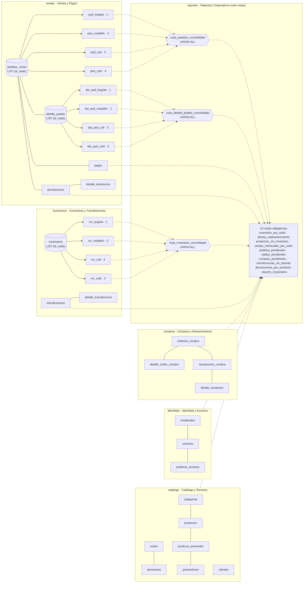

```mermaid
flowchart LR
    subgraph CAT["catalogo · Catálogo y Terceros"]
        sedes[sedes] --- almacenes[almacenes]
        categorias[categorias] --- productos[productos]
        productos --- prodprov[producto_proveedor] --- proveedores[proveedores]
        clientes[clientes]
    end

    subgraph IDE["identidad · Identidad y Accesos"]
        empleados[empleados] --- usuarios[usuarios] --- auditoria[auditoria_accesos]
    end

    subgraph COM["compras · Compras y Abastecimiento"]
        oc[ordenes_compra] --- doc[detalle_orden_compra]
        oc --- rec[recepciones_compra] --- drec[detalle_recepcion]
    end

    subgraph INV["inventarios · Inventarios y Transferencias"]
        inv[("inventarios<br/>LIST (id_sede)")]
        inv --> inv1[inv_bogota · 1]
        inv --> inv2[inv_medellin · 2]
        inv --> inv3[inv_cali · 3]
        inv --> inv4[inv_cedi · 4]
        tra[transferencias] --- dtra[detalle_transferencia]
    end

    subgraph VEN["ventas · Ventas y Pagos"]
        ped[("pedidos_venta<br/>LIST (id_sede)")]
        ped --> ped1[ped_bogota · 1]
        ped --> ped2[ped_medellin · 2]
        ped --> ped3[ped_cali · 3]
        ped --> ped4[ped_cedi · 4]
        det[("detalle_pedido<br/>LIST (id_sede)")]
        det --> det1[det_ped_bogota · 1]
        det --> det2[det_ped_medellin · 2]
        det --> det3[det_ped_cali · 3]
        det --> det4[det_ped_cedi · 4]
        ped --- det
        ped --- pagos[pagos]
        ped --- dev[devoluciones] --- ddev[detalle_devolucion]
    end

    subgraph REP["reportes · Reportes Corporativos (solo vistas)"]
        vinv{{vista_inventario_consolidado<br/>UNION ALL}}
        vped{{vista_pedidos_consolidado<br/>UNION ALL}}
        vdet{{vista_detalle_pedido_consolidado<br/>UNION ALL}}
        v10["10 vistas obligatorias<br/>inventario_por_sede · alertas_reabastecimiento<br/>productos_sin_inventario · ventas_mensuales_por_sede<br/>pedidos_pendientes · saldos_pendientes<br/>compras_pendientes · transferencias_en_transito<br/>devoluciones_por_producto · reporte_corporativo"]
    end

    inv1 & inv2 & inv3 & inv4 -.-> vinv
    ped1 & ped2 & ped3 & ped4 -.-> vped
    det1 & det2 & det3 & det4 -.-> vdet
    vinv & vped & vdet -.-> v10
    CAT -.-> v10
    IDE -.-> v10
    COM -.-> v10
    tra -.-> v10
    pagos -.-> v10
    dev -.-> v10
```
